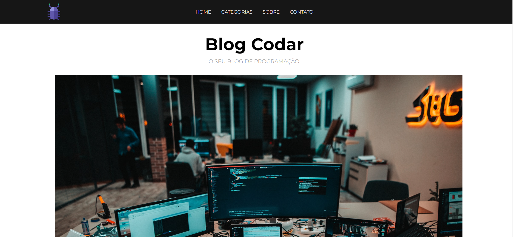

<h1 align="center">Blog | Desenvolvido em PHP</h1>

**<p align="center">Sumário</p>**
<p align="center">
<a href="#dart-sobre">Sobre</a> &#xa0; | &#xa0;
<a href="#computer-tecnologias">Tecnologias</a> |
<a href="#books-o-que-eu-aprendi">O que aprendi</a> &#xa0; 
</p>
<p align="center">
<a href="#hammer_and_wrench-serviços">Serviços</a> &#xa0; | &#xa0;
<a href="#scroll-rodando-o-projeto">Rodando o projeto</a> &#xa0; | &#xa0;
<a href="#sparkles-autor">Autor</a>
</p>

<p align="center">


</p>

&#xa0;
 
## :dart: Sobre
<p>Projeto de estudo prático desenvolvido durante o curso de PHP.</p>
<p>Neste projeto pude praticar os conceitos de geração de elementos HTML dinamicamente utilizando estruturas de Arrays e laços de repetições com PHP.</p>

<h1 align="center">Print do Resultado</h1>
<div align="center">

</div>

<h2 align="center">Resultado no Desktop</h2>
<div align="center">

</div>

<h2 align="center">Resultado no Mobile</h2>
<div align="center">

</div>


&#xa0;

## :computer: Tecnologias
* [HTML](https://developer.mozilla.org/pt-BR/docs/Web/HTML)

* [CSS](https://www.w3schools.com/css/)

* [PHP](https://www.php.net/)

&#xa0;

## :hammer_and_wrench: Serviços
* <a href="https://github.com/">GitHub</a>
* <a href="https://www.apachefriends.org/pt_br/index.html">XAMPP | Apache</a>

&#xa0;

## :books: O que eu aprendi?

📌 Geração de elementos HTML dinamicamente utilizando PHP;

📌 Iterações de estruturas de Arrays com laços de repetições;

📌 Responsividade utilizando Medias Queries;

&#xa0;

## :scroll: Rodando o projeto
É necessário um navegador

```bash
# Clone este repositório
$ git clone https://github.com/viniciuslemos93/blog.git

# Baixe e instale o Xammp Apache

# Após instalação do Xampp, ele criará uma pasta chamada "xampp", em "C:\xampp\"

# Cole o repositório deste projeto na pasta "htdocs", localizada em "C:\xampp\htdocs"

# Abra o XAMPP Server, e inicialize o Apache 

# Abra seu navegador, e acesse: http://localhost/blog/
```

&#xa0;

## :sparkles: Autor

<h4>Desenvolvido por Vinicius Lemos</h4>

<a href="https://github.com/viniciuslemos93">

</a>

&#xa0;

[](https://www.linkedin.com/in/viniciuslemos93/)<br>
